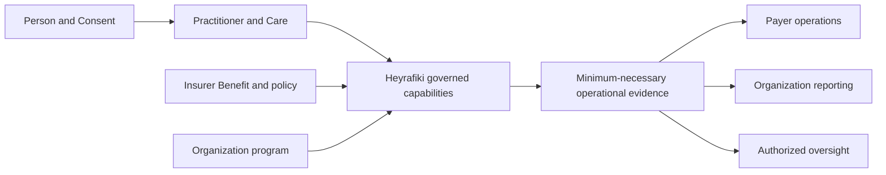

Institutional integrations use versioned resources for Practitioner discovery, Bookings, Benefits, Claims and remittance.

<Columns cols={2}>
  <Card title="Insurers and payers" icon="shield-check" href="/insurance/integration-guide">
    Connect Coverage, eligibility, pre-authorization, Claims, remittance and reconciliation.
  </Card>
  <Card title="Government and regulators" icon="landmark" href="#government-and-regulatory-readiness">
    Review authority, data minimization, audit evidence and controlled exchange boundaries.
  </Card>
  <Card title="Health Organizations" icon="hospital" href="#health-organizations">
    Coordinate Care through purpose-bound Practitioner, Booking and Session capabilities.
  </Card>
  <Card title="Research and open ecosystems" icon="flask" href="#research">
    Use approved protocols, synthetic environments and versioned public contracts.
  </Card>
</Columns>

## One operating model

Identity, clinical records, Benefit decisions and payment evidence keep separate authorities. Heyrafiki connects them through typed capabilities, explicit purpose, Organization boundaries, replay-safe writes and auditable state transitions.

## Integration boundaries

| Boundary | Contract |
| --- | --- |
| Access | Organization-scoped credentials, project isolation and least-privilege scopes |
| Cover and Claims | Idempotent eligibility, pre-authorization, Claim and remittance workflows |
| Events | Signed Webhooks, request IDs and bounded retries |
| Data | Synthetic sandbox records and purpose-bound production access |

Credential issuers remain authoritative for professional status. Payers remain authoritative for Benefit and Claim decisions. API responses carry references to those decisions.

## Five-role acceptance model

<Tabs>
  <Tab title="Payer engineering" icon="code">
    Verify Coverage ingestion, eligibility, pre-authorization, Claim adjudication, remittance, Webhooks, retries and cross-tenant denial against the versioned contract.
  </Tab>
  <Tab title="Actuarial and finance" icon="calculator">
    Recompute line and Claim identities, reconcile advice to independent settlement evidence, and preserve service, submission, adjudication and payment dates for governed analysis.
  </Tab>
  <Tab title="Care operations" icon="stethoscope">
    Confirm that service evidence connects delivered Care to the covered workflow while Clinical Notes, Messages and private Session content remain outside the payer contract.
  </Tab>
  <Tab title="Security and privacy" icon="lock">
    Exercise Organization isolation, least-privilege scopes, synthetic-only test data, signature validation, stale-event rejection and minimum-necessary response fields.
  </Tab>
  <Tab title="Governance and audit" icon="scale-balanced">
    Retain the contract commit, owner map, request identifiers, idempotency evidence, negative-test results, policy versions, reconciliation evidence and activation decision.
  </Tab>
</Tabs>

The [insurance acceptance plan](/insurance/acceptance-testing) turns these roles into one reproducible evidence pack. Sandbox access is issued to an approved Organization and stays isolated from production.

## Available contract

The sandbox provides:

- Practitioner discovery and recurring availability;
- tenant-scoped Bookings and Sessions;
- Benefit eligibility and pre-authorization;
- project-scoped Claim submission, review and adjudication;
- remittance allocation and reconciliation;
- signed Webhook endpoint management;
- read-only MCP tools over the same resources.

Use separate projects and keys for each environment. Sandbox data is synthetic.

## Insurers and payers

Check eligibility before committing Cover. Where authorization is required, bind the eligibility decision to a covered Booking. Submit Claims from delivered Care, record line decisions, then allocate remittance against the approved amount.

Clinical Notes, message content and unrelated identity data are outside the payer contract.

Start with the [insurance integration guide](/insurance/integration-guide), then review the [financial controls](/insurance/financial-controls) and [acceptance test plan](/insurance/acceptance-testing).

## Health Organizations

Use Practitioner, availability, Booking and Session resources to coordinate Care. Organization access remains purpose-bound and does not expose an individual's Diagnosis or private Care activity.

## Regulators and public systems

Use the sandbox to test identity, Consent, terminology and exchange mappings with synthetic data. Production access follows the authority's active requirements and approval process.

### Government and regulatory readiness

| Review area | Evidence available now | Production decision owner |
| --- | --- | --- |
| Contract and interoperability | OpenAPI 3.1, stable identifiers, typed errors, versioning and public SDK source | Joint architecture review |
| Identity and authority | Organization, project, scope, role and purpose boundaries | Institution identity and security owners |
| Privacy | Opaque payer references, separated clinical content and minimum-necessary schemas | Institution privacy owner and Heyrafiki privacy owner |
| Financial control | Integer minor units, balanced adjudication lines, idempotency and independent settlement matching | Payer finance and operations owners |
| Auditability | Request IDs, policy versions, append-only decisions, Webhook identifiers and evidence references | Authorized governance and audit owners |
| Resilience | Bounded retries, same-key replay, deterministic conflict behavior and rollback ownership | Joint operations owners |
| Pilot safety | Synthetic data, environment isolation, negative tests and activation gates | Named pilot steering group |

<Info>
  A production integration activates only after the institution approves its authority mapping, data purpose, security controls and operating owners. The system contract and synthetic pilot remain available for technical due diligence before that decision.
</Info>

## Research

Research access requires an approved protocol and the minimum permitted data. Approved exports retain their provenance and access controls.

See [Security](/security/overview), [Data boundaries](/security/data-boundaries), [Authentication](/authentication) and [Webhooks](/webhooks).
