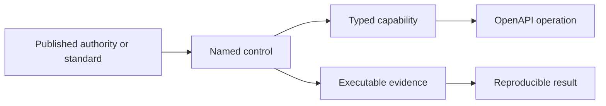

The Assurance Graph connects each public API operation to an accountable capability, control owner, governing source and executable evidence artifact. It gives insurer, government, regulator, security and engineering reviewers one path from a public statement to the contract and test that support it.

The graph describes verified Heyrafiki behavior. It does not claim regulatory approval, certification or partnership.



## What the graph proves

| Question | Evidence path |
| --- | --- |
| Who owns this capability? | Capability to named engineering, finance, clinical, privacy or reliability owner |
| Which public source informs the control? | Control to IRA, DHA, CPB, government integration boundary or Heyrafiki domain authority |
| Which API operations implement it? | Capability to unique OpenAPI operation identifiers |
| How can a reviewer test it? | Control to fixture, schema and deterministic verification command |
| What happens when the contract grows? | CI fails when an operation has no accountable capability or references missing evidence |

## Kenyan authority boundaries

<AccordionGroup>
  <Accordion title="Insurance Regulatory Authority" icon="shield-check" defaultOpen>
    IRA governs insurance supervision, market conduct and policyholder protection. Heyrafiki records the Claims, decision, communication, financial and audit evidence an accountable insurer can inspect. Heyrafiki does not become the insurer or supervisory authority.
  </Accordion>
  <Accordion title="Ministry of Health and Digital Health Agency" icon="hospital">
    DHA defines digital health certification and national exchange requirements. Heyrafiki keeps registry identifiers, coded data, Consent, audit and adapter versions explicit at this boundary.
  </Accordion>
  <Accordion title="Counsellors and Psychologists Board" icon="id-card">
    CPB remains authoritative for counsellor and psychologist registration and licensing. Heyrafiki records the source observation, category, licence period and freshness separately from a Platform Care-eligibility decision.
  </Accordion>
  <Accordion title="eCitizen and GavaConnect" icon="landmark">
    These are approved government access and integration paths. They do not become the authority for clinical facts, insurance decisions or Heyrafiki ledger state.
  </Accordion>
</AccordionGroup>

## Current graph coverage

The graph maps 30 public operations into 10 accountable capabilities and 9 controls. It covers API discovery, Practitioners, Bookings, Sessions, eligibility, Coverage, pre-authorization, Claims, remittance and Webhooks.

<CardGroup cols={2}>
  <Card title="Run the benchmark" icon="flask" href="https://github.com/heyrafiki/openapi/blob/main/BENCHMARK.md">
    Reproduce four suites and five adversarial mutation checks from the public manifest.
  </Card>
  <Card title="Open the graph" icon="diagram-project" href="https://github.com/heyrafiki/openapi/blob/main/assurance/assurance-graph.json">
    Inspect the machine-readable capability, source, control and evidence links.
  </Card>
  <Card title="Read the schema" icon="brackets-curly" href="https://github.com/heyrafiki/openapi/blob/main/assurance/assurance-graph.schema.json">
    Validate the graph independently with JSON Schema 2020-12.
  </Card>
</CardGroup>

```bash
git clone https://github.com/heyrafiki/openapi.git
cd openapi
npm ci
npm test
```

The suite validates the OpenAPI contract, financial invariants, the bitemporal Claim valuation timeline and graph referential integrity.

## Capability and access

API discovery and the public evidence repository are open. Sandbox operations use a sandbox key. Institutional capabilities use scoped Organization grants with separately approved production authority.

Create a key in the [Developer Platform](https://app.heyrafiki.space/dev/keys) if your Organization has access. Otherwise [request access](https://heyrafiki.space/waitlist) and review the [synthetic pilot acceptance plan](/insurance/acceptance-testing) now.

## Research surface

The open conformance system provides a reproducible base for research in reported Claim development, mental-health Benefit utilization, provider-network capacity, privacy-constrained aggregation and Consent-aware computation. A research claim requires a formal problem, stated assumptions, baseline methods, reproducible synthetic or approved data, evaluation results and expert review.

That boundary is deliberate. The graph makes a new hypothesis testable; it does not label an untested idea as new mathematics.
