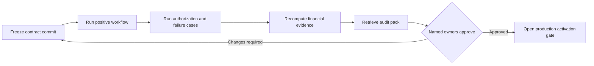

Use one isolated Sandbox project and synthetic records for the full payer pilot. Keep the API key in a secret manager and store the request ID, idempotency key and resulting resource identifier for every write.

<Tip>
  Run the pilot as one shared evidence room. Payer engineering, actuarial and finance, Care operations, security and privacy, and governance each sign off on their own controls against the same synthetic workflow.
</Tip>

## Pilot control room

<Tabs>
  <Tab title="Engineering" icon="terminal">
    Own the contract commit, environment mapping, retry policy, idempotency keys, Webhook consumer and integration logs.
  </Tab>
  <Tab title="Finance" icon="chart-line">
    Own independent amount recomputation, Benefit interpretation, valuation assumptions, remittance allocation and settlement variance review.
  </Tab>
  <Tab title="Care" icon="clipboard-check">
    Own service-code mapping, Practitioner workflow, delivered-service evidence and escalation when operational evidence is incomplete.
  </Tab>
  <Tab title="Privacy" icon="fingerprint">
    Own scopes, tenant isolation, synthetic-data controls, secret handling, signature verification and data-minimization review.
  </Tab>
  <Tab title="Governance" icon="file-shield">
    Own policy references, decision authority, audit retrieval, incident contacts, activation approval and rollback authority.
  </Tab>
</Tabs>



## Acceptance sequence

| Sequence | Test | Evidence to retain |
| --- | --- | --- |
| 1 | Record a versioned Coverage observation | Source reference, source version, observation ID and snapshot version |
| 2 | Replay the same observation | Same response and `replayed` behavior, with no second observation |
| 3 | Reuse the key with different content | Deterministic conflict response |
| 4 | Check eligible and ineligible services | Decision, reason codes, effective time and limits |
| 5 | Approve a required pre-authorization twice | One authorization and one Benefit reservation |
| 6 | Submit a Claim for delivered Care | Claim ID, submission version, service code and evidence references |
| 7 | Request and submit bounded evidence | Information request, evidence references and new submission version |
| 8 | Reject an unbalanced adjudication | Validation error with no financial state change |
| 9 | Record a balanced partial approval | Policy version, line decisions, reasons and payer amount |
| 10 | Submit remittance advice | Allocation evidence without a settlement claim |
| 11 | Match an independent settlement observation through the approved pilot adapter | Reconciled remittance, balanced ledger evidence and settled Claim state |
| 12 | Deliver a duplicate Webhook | One business action despite repeated delivery |

## Authorization tests

Run each request with the expected scope, without the scope, against another Organization and against a production identifier from the Sandbox project.

Expected results:

- the correct scope and tenant can reach the resource;
- a missing scope returns `403`;
- a foreign or unavailable resource returns `404` without confirming its existence;
- Sandbox credentials cannot act on production data;
- payer resources do not expose Person identity or clinical content.

## Failure and retry tests

Exercise:

- malformed JSON and unknown fields;
- an invalid service code or source version;
- expired Coverage and exhausted Benefits;
- authorization for the wrong Booking or service;
- Claim submission before Session delivery;
- missing requested evidence;
- duplicate Claim references;
- currency mismatch and remittance over-allocation;
- `429` handling with backoff;
- a timeout followed by a same-key retry;
- Webhook signature failure, stale timestamp and duplicate event delivery.

## Financial assertions

For every adjudicated Claim, independently recompute:

```text
line.allowed = line.payer + line.patient_responsibility
line.billed = line.allowed + line.adjustment
claim totals = exact sums of line amounts
advice outstanding = approved payer amount - cumulative remittance allocations
settlement outstanding = approved payer amount - cumulative matched settlement
```

Reject the pilot if the API accepts an unbalanced amount, changes the result of a same-key replay, crosses an Organization boundary or represents remittance advice as settlement.

## Operational evidence pack

The pilot evidence pack should contain:

- the OpenAPI contract commit used by both teams;
- the payer-to-service-code mapping and its version;
- environment, Organization and scope mapping;
- synthetic request and response fixtures;
- authorization and negative-test results;
- idempotency and retry results;
- Webhook verification results;
- financial reconciliation results;
- named owners for payer operations, security, privacy and incident response;
- the production activation and rollback checklist.

Do not place keys, personal data, clinical records or payment credentials in the evidence pack.

<AccordionGroup>
  <Accordion title="Minimum evidence pack structure" icon="folder-tree" defaultOpen>
    <Tree>
      <Tree.Folder name="01-contract" defaultOpen>
        <Tree.File name="openapi-commit.txt" />
        <Tree.File name="service-code-map.csv" />
        <Tree.File name="scope-map.md" />
      </Tree.Folder>
      <Tree.Folder name="02-execution">
        <Tree.File name="synthetic-fixtures.json" />
        <Tree.File name="request-index.csv" />
        <Tree.File name="negative-tests.md" />
      </Tree.Folder>
      <Tree.Folder name="03-financial-controls">
        <Tree.File name="claim-recalculation.csv" />
        <Tree.File name="remittance-reconciliation.csv" />
      </Tree.Folder>
      <Tree.Folder name="04-governance">
        <Tree.File name="owner-map.md" />
        <Tree.File name="activation-checklist.md" />
        <Tree.File name="rollback-plan.md" />
      </Tree.Folder>
    </Tree>
  </Accordion>
  <Accordion title="Evidence that must stay outside the pack" icon="ban">
    API keys, WorkOS credentials, Person identity, Clinical Notes, Session content, Assessment answers, payment credentials and unrestricted production exports remain outside the pilot repository.
  </Accordion>
</AccordionGroup>

## Exit criteria

The integration is ready for production approval when both teams can reproduce the full sequence, every negative test fails closed, financial totals reconcile, audit evidence is retrievable and the named owners approve activation.

[Request Sandbox access](https://heyrafiki.space/waitlist) to begin the pilot.
