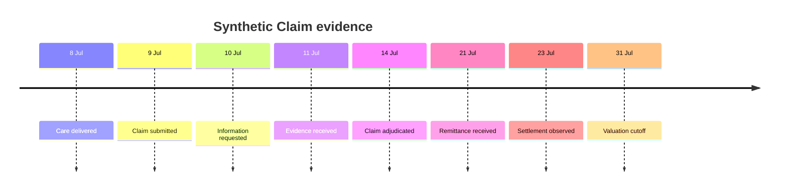

Heyrafiki records when each Claim fact became effective and when the system learned it. This bitemporal history separates service, report, adjudication, remittance and settlement lag, and makes an as-of financial view reproducible.

<Columns cols={3}>
  <Card title="Business time" icon="calendar">
    `effective_at` records when the underlying Care, decision or money fact took effect.
  </Card>
  <Card title="Knowledge time" icon="clock">
    `recorded_at` records when Heyrafiki received and persisted the fact.
  </Card>
  <Card title="Valuation time" icon="calculator">
    `valuation_at` excludes every fact recorded after the stated cutoff.
  </Card>
</Columns>

<Tip>
  A backdated adjustment first received on 2 August does not change what was known on 31 July. Re-run the same cutoff and the same ordered event history produces the same result.
</Tip>

## One Claim, three clocks



The public fixture keeps policy reference and version, source authority, reason codes and bounded evidence references with every relevant transition. Person identity and clinical content remain outside the payer timeline.

## Reproduce the as-of amount

For the synthetic fixture, all money is in integer KES minor units:

```text
billed = payer_liability + patient_responsibility + adjustment
600000 = 450000 + 50000 + 100000

outstanding = payer_liability - observed_settlement
100000 = 450000 - 350000
```

Remittance remains payer advice. Settlement remains independent evidence of money movement. The timeline does not mark a Claim settled from an advice file alone.

<Tabs>
  <Tab title="Actuarial" icon="calculator">
    Reconstruct reported Claim development by service, report, decision and settlement dates. Preserve zero-Claim exposure and define the cohort, valuation basis and treatment of reopened or reversed Claims before calculating a portfolio measure.
  </Tab>
  <Tab title="Finance" icon="scale-balanced">
    Reconcile payer liability to advice, observed movement, ledger evidence and the remaining outstanding amount without netting unrelated balances.
  </Tab>
  <Tab title="Regulatory review" icon="landmark">
    Trace the Claim from effective policy version through coded decision, communication event, remittance and settlement observation. Each transition retains its source authority and recorded time.
  </Tab>
  <Tab title="Engineering" icon="code">
    Validate gapless event sequence, unique event identifiers, nondecreasing knowledge time, integer amounts and balanced adjudication in CI.
  </Tab>
</Tabs>

## Inspect the public evidence

The [synthetic valuation fixture](https://github.com/heyrafiki/openapi/blob/main/fixtures/claim-valuation-timeline.json), [JSON Schema](https://github.com/heyrafiki/openapi/blob/main/assurance/claim-valuation-timeline.schema.json) and [conformance test](https://github.com/heyrafiki/openapi/blob/main/scripts/check-claim-valuation-timeline.mjs) live with the OpenAPI contract.

```bash
git clone https://github.com/heyrafiki/openapi.git
cd openapi
npm ci
npm run test:financial-controls
```

The check rejects future knowledge, invalid sequence, non-integer money, unbalanced adjudication and an outstanding amount that cannot be reproduced.

## Actuarial boundary

This timeline supports analysis of reported Claims and reproducible outstanding observations. Portfolio reserve selection, IBNR, premium liability, capital, solvency, reinsurance and actuarial opinions remain with the insurer and its appointed actuarial authority.

<Info>
  The open fixture uses synthetic data. An approved Organization can test the same contract in the [Sandbox](/sandbox), then define its production data mapping, valuation policy and control owners through the institutional review.
</Info>

Continue with [financial controls](/insurance/financial-controls), the [Assurance Graph](/institutions/assurance-graph) and the [acceptance test plan](/insurance/acceptance-testing).
