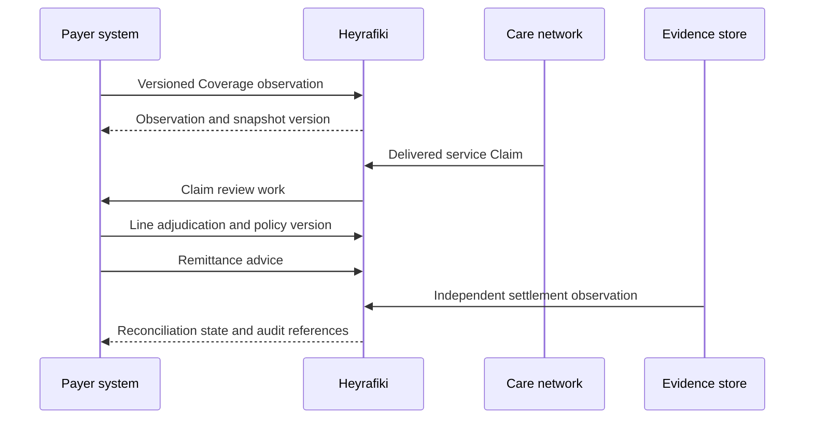
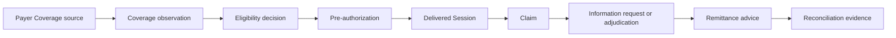

An insurer connects to Heyrafiki through versioned payer observations and explicit workflow decisions. The insurer remains authoritative for membership, Benefit design, adjudication policy and payment advice. Heyrafiki records the bounded operational evidence that connects those decisions to delivered Care.

<Columns cols={3}>
  <Card title="Coverage" icon="shield-check" href="/benefits">
    Version payer observations without silently replacing their source history.
  </Card>
  <Card title="Claims" icon="file-invoice" href="/claims">
    Submit delivered Care, request evidence and record line decisions.
  </Card>
  <Card title="Controls" icon="scale-balanced" href="/insurance/financial-controls">
    Review amount identities, authority boundaries and reconciliation rules.
  </Card>
</Columns>

<Tip>
  Start the pilot with one Benefit product, one service family and one synthetic cohort. Prove authority, retry safety, line arithmetic and reconciliation before expanding the mapping.
</Tip>

## Integration architecture



The payer controls membership, Benefit design and adjudication policy. Heyrafiki controls the workflow contract, authorization boundary, retry behavior and audit evidence. The Practitioner controls the clinical record. A payment source supplies settlement evidence independently from payer advice.

## End-to-end flow



<Steps>
  <Step title="Establish the authority mapping">
    Map one payer tenant to one Heyrafiki Organization and issue a separate project for each environment. Grant only the scopes required by the integration.
  </Step>
  <Step title="Load Coverage">
    Send individual observations through `POST /coverages`, or batches of up to 500 records through `POST /coverage_batches`. Each observation carries its source contract, source version, effective period and evidence references.
  </Step>
  <Step title="Check the Benefit">
    Call `POST /eligibility_checks` for the service date and requested amount. Treat `ineligible` as a decision with reason codes, not as a transport failure.
  </Step>
  <Step title="Reserve authorization when required">
    Create a pre-authorization from the eligibility decision and covered Booking. The payer records the decision through `POST /preauthorizations/{preauthorization_id}/decisions`.
  </Step>
  <Step title="Submit delivered Care">
    Create the Claim only after the covered Session is delivered. Send service codes, units, amounts and evidence references. Clinical Notes and private Conversation content do not enter this contract.
  </Step>
  <Step title="Adjudicate every line">
    Request bounded evidence when necessary, then record a versioned policy reference, line amounts and coded reasons through `POST /claims/{claim_id}/adjudications`.
  </Step>
  <Step title="Reconcile payer advice">
    Send remittance advice with allocations to Claims. Heyrafiki keeps advice separate from independent settlement evidence so an advice file cannot assert that money moved.
  </Step>
</Steps>

## Record the first Coverage observation

The same request shape works across supported HTTP clients. Amounts are integers in the currency's minor unit.

<CodeGroup>

```bash cURL
curl https://api.heyrafiki.space/v1/coverages \
  --request POST \
  --header "Authorization: Bearer $HEYRAFIKI_API_KEY" \
  --header "Content-Type: application/json" \
  --header "Idempotency-Key: coverage-synthetic-0001-v1" \
  --data '{
    "source_contract_reference": "payer:product:mental-health-2026",
    "external_coverage_reference": "coverage:synthetic:0001",
    "source_version": "2026-08-10T07:00:00Z",
    "tenant_reference": "payer:sandbox",
    "member_reference": "member:synthetic:0001",
    "plan_name": "Mental Health Benefit",
    "service_code": "psychotherapy-60",
    "status": "active",
    "currency": "KES",
    "amount_limit": 600000,
    "remaining_sessions": 8,
    "authorization_required": true,
    "coordination_priority": 1,
    "valid_from": "2026-01-01T00:00:00Z",
    "valid_until": "2026-12-31T23:59:59Z",
    "observed_at": "2026-08-10T07:00:00Z",
    "evidence_references": ["payer:source:synthetic:0001"]
  }'
```

```javascript Node.js
const response = await fetch("https://api.heyrafiki.space/v1/coverages", {
  method: "POST",
  headers: {
    Authorization: "Bearer " + process.env.HEYRAFIKI_API_KEY,
    "Content-Type": "application/json",
    "Idempotency-Key": "coverage-synthetic-0001-v1",
  },
  body: JSON.stringify({
    source_contract_reference: "payer:product:mental-health-2026",
    external_coverage_reference: "coverage:synthetic:0001",
    source_version: "2026-08-10T07:00:00Z",
    tenant_reference: "payer:sandbox",
    member_reference: "member:synthetic:0001",
    plan_name: "Mental Health Benefit",
    service_code: "psychotherapy-60",
    status: "active",
    currency: "KES",
    amount_limit: 600000,
    remaining_sessions: 8,
    authorization_required: true,
    coordination_priority: 1,
    valid_from: "2026-01-01T00:00:00Z",
    valid_until: "2026-12-31T23:59:59Z",
    observed_at: "2026-08-10T07:00:00Z",
    evidence_references: ["payer:source:synthetic:0001"],
  }),
});

if (!response.ok) throw new Error("Coverage request failed: " + response.status);
console.log(await response.json());
```

```python Python
import os
import httpx

response = httpx.post(
    "https://api.heyrafiki.space/v1/coverages",
    headers={
        "Authorization": f"Bearer {os.environ['HEYRAFIKI_API_KEY']}",
        "Idempotency-Key": "coverage-synthetic-0001-v1",
    },
    json={
        "source_contract_reference": "payer:product:mental-health-2026",
        "external_coverage_reference": "coverage:synthetic:0001",
        "source_version": "2026-08-10T07:00:00Z",
        "tenant_reference": "payer:sandbox",
        "member_reference": "member:synthetic:0001",
        "plan_name": "Mental Health Benefit",
        "service_code": "psychotherapy-60",
        "status": "active",
        "currency": "KES",
        "amount_limit": 600000,
        "remaining_sessions": 8,
        "authorization_required": True,
        "coordination_priority": 1,
        "valid_from": "2026-01-01T00:00:00Z",
        "valid_until": "2026-12-31T23:59:59Z",
        "observed_at": "2026-08-10T07:00:00Z",
        "evidence_references": ["payer:source:synthetic:0001"],
    },
    timeout=10,
)
response.raise_for_status()
print(response.json())
```

</CodeGroup>

<AccordionGroup>
  <Accordion title="201 · Coverage observation" icon="circle-check" defaultOpen>
    ```json
    {
      "id": "cobs_synthetic_0001",
      "object": "coverage_observation",
      "coverage_id": "cov_synthetic_0001",
      "source": "payer_api",
      "source_contract_reference": "payer:product:mental-health-2026",
      "external_coverage_reference": "coverage:synthetic:0001",
      "source_version": "2026-08-10T07:00:00Z",
      "snapshot_version": 1,
      "status": "active",
      "service_code": "psychotherapy-60",
      "amount_limit": { "currency": "KES", "value": 600000 },
      "remaining_sessions": 8,
      "authorization_required": true,
      "coordination_priority": 1,
      "valid_from": "2026-01-01T00:00:00Z",
      "valid_until": "2026-12-31T23:59:59Z",
      "observed_at": "2026-08-10T07:00:00Z"
    }
    ```
  </Accordion>
  <Accordion title="Replay and conflict behavior" icon="rotate">
    Repeating the same payload with the same idempotency key returns the original observation with `200`. Reusing that key with different content returns `409` and writes no second observation.
  </Accordion>
</AccordionGroup>

## Source data contract

| Payer field | Heyrafiki field | Rule |
| --- | --- | --- |
| Membership key | `member_reference` | Send an opaque stable reference. Do not send a name, contact detail or government identifier. |
| Product contract | `source_contract_reference` | Identify the policy or Benefit contract that produced the observation. |
| Source revision | `source_version` or `record_version` | Increase when the payer source changes. Reusing an idempotency key with different content is rejected. |
| Service Benefit | `service_code` | Use the agreed versioned payer-to-Heyrafiki code mapping. |
| Limit | `amount_limit` | Send the per-Session limit in the currency's minor unit. |
| Utilization balance | `remaining_sessions` | Send the balance observed by the payer source. |
| Coordination | `coordination_priority` | Use `1` for primary; leave null when coordination does not apply. |
| Source evidence | `evidence_references` | Retain the source artifact at the payer and send bounded references only. |

## Control ownership

| Decision | Authority | Heyrafiki responsibility |
| --- | --- | --- |
| Member eligibility | Payer source | Preserve source, version, effective time and the resulting observation. |
| Pre-authorization | Authorized payer reviewer | Bind the decision to the eligible Booking and reserve the Benefit once. |
| Clinical record | Practitioner | Keep clinical content outside payer APIs and expose only permitted service evidence. |
| Claim adjudication | Authorized payer reviewer | Enforce line arithmetic, policy provenance, reason codes and append-only versions. |
| Payment advice | Payer | Allocate advice without representing it as settlement. |
| Settlement observation | Authorized payment source | Record independent evidence and reconcile it to the advice. |

## Retry and recovery rules

- Send an `Idempotency-Key` on every supported write.
- Retry `429` and retryable `503` responses only after the stated delay.
- Treat a timeout after submission as unknown. Retry with the same idempotency key.
- Treat `409` as a state or idempotency conflict that requires review.
- Persist the `X-Request-Id` with the payer's integration log.
- Consume Webhooks idempotently using the stable event identifier.

## Data boundary

Payer APIs use opaque Member and evidence references. They exclude names, contacts, Diagnoses, Clinical Notes, Session content, Messages, Journal text and Assessment answers. Organization and project boundaries are enforced before resource access and again at the workflow capability.

## Integration entry point

Use the [OpenAPI 3.1 contract](https://github.com/heyrafiki/contract), [Proving Ground](https://github.com/heyrafiki/proving-ground), [Sandbox](/sandbox) and [acceptance test plan](/insurance/acceptance-testing) for technical due diligence. [Request Sandbox access](https://heyrafiki.space/waitlist) when your integration team is ready to test.
