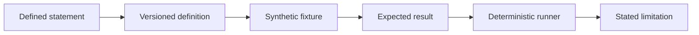

Heyrafiki publishes evidence that another team can inspect and run. The public path starts with a defined statement and ends with a versioned definition, synthetic fixture, expected result, deterministic runner and visible limitation.



## Public evidence authorities

| Authority | What it owns | Inspect it |
| --- | --- | --- |
| API definition | The public REST interface and machine-readable Assurance Graph | [heyrafiki/contract](https://github.com/heyrafiki/contract) |
| Proving Ground | Deterministic conformance suites, fixtures and expected results | [heyrafiki/proving-ground](https://github.com/heyrafiki/proving-ground) |
| Docs | Integration guidance and the meaning of released public behavior | [heyrafiki/docs](https://github.com/heyrafiki/docs) |
| SDK repositories | Language-specific source maintained against the public API definition | [SDK guide](/sdks) |

The Platform implementation remains the authority for runtime behavior. Public repositories make API definitions and selected evidence independently inspectable without becoming a second runtime authority.

## First Light v2

First Light v2 tests longitudinal assessment conformance with a fixed synthetic cohort. The public pack contains 48 cases, knowledge-time and amendment scenarios, adverse boundaries, expected results and audit-completeness checks.

<CardGroup cols={2}>
  <Card title="Read the methodology" icon="book-open" href="https://github.com/heyrafiki/proving-ground/blob/main/benchmarks/first-light/v2/methodology.md">
    Review the declared synthetic cohort, measures and interpretation boundary.
  </Card>
  <Card title="Inspect the evidence boundary" icon="scale-balanced" href="https://github.com/heyrafiki/proving-ground/blob/main/benchmarks/first-light/v2/evidence-boundary.md">
    See which conclusions the benchmark includes and excludes.
  </Card>
  <Card title="Open the protocol" icon="file-code" href="https://github.com/heyrafiki/proving-ground/blob/main/benchmarks/first-light/v2/protocol.json">
    Inspect the machine-readable version, assumptions and checks.
  </Card>
  <Card title="Open the evidence pack" icon="flask" href="https://github.com/heyrafiki/proving-ground/blob/main/benchmarks/first-light/v2/pilot-evidence-pack.md">
    Read the generated results beside their limitations.
  </Card>
</CardGroup>

Run the full public evidence repository:

```bash
git clone https://github.com/heyrafiki/proving-ground.git
cd proving-ground
npm ci
npm test
```

## What the current evidence supports

The public suites support claims about API coverage, deterministic scoring, bitemporal replay, Consent-aware access boundaries, audit completeness and rejection of declared adversarial mutations.

Separate clinical and population studies are required for:

- clinical validity or diagnostic performance;
- effectiveness for a Kenyan or other real population;
- actuarial savings or health outcomes;
- safety under every production condition;
- claims beyond the declared protocol and evidence.

Those conclusions require a separate protocol, appropriate approvals, licensed instruments, representative data, baseline methods, uncertainty estimates and expert review.

## From architecture to a research result

A research candidate is ready for formal evaluation only when its problem, assumptions, prior art, baseline, protocol, measures, data rights, failure implications and review owner are written down before outcome claims are made.

The [Assurance Graph](/institutions/assurance-graph) provides the traceability layer. It connects public operations and controls to executable evidence. Comparative research follows its declared protocol and independent review.

### Comparative evaluation

The public protocol tests a two-cutoff, Consent-conditional assurance-path query with fail-closed completeness. It declares the comparators, measures, stopping rules and independent review path before evaluation.

<CardGroup cols={2}>
  <Card title="Read the evaluation protocol" icon="list-check" href="https://github.com/heyrafiki/proving-ground/blob/main/research/consent-aware-bitemporal-assurance-graph/protocol.md">
    Review the formal query, five baselines, fixed measures and stopping rules.
  </Card>
  <Card title="Read the manuscript" icon="file-lines" href="https://github.com/heyrafiki/proving-ground/blob/main/research/consent-aware-bitemporal-assurance-graph/manuscript.md">
    Inspect the article structure and declared evidence boundary.
  </Card>
  <Card title="Inspect the prior-art search" icon="magnifying-glass-chart" href="https://github.com/heyrafiki/proving-ground/blob/main/research/consent-aware-bitemporal-assurance-graph/prior-art-search.md">
    See the closest standards, papers and patent families found by the author search.
  </Card>
  <Card title="Open the reviewer packet" icon="user-shield" href="https://github.com/heyrafiki/proving-ground/blob/main/research/consent-aware-bitemporal-assurance-graph/reviewer-checklist.md">
    Follow the independent review, freeze and reproduction gates.
  </Card>
</CardGroup>

## Reporting a mismatch

If a public statement, API definition, fixture or result disagrees with another authority, open an issue in the repository that owns the mismatched artifact. Security and privacy findings should follow the private process in the [Security overview](/security/overview).
